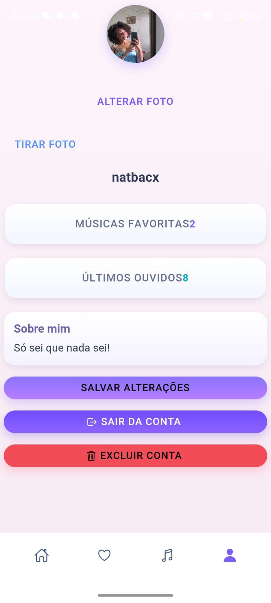
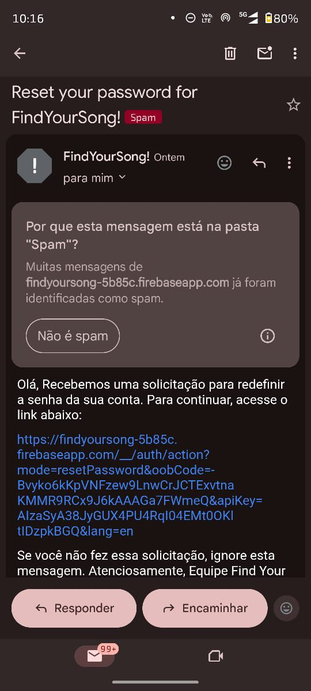
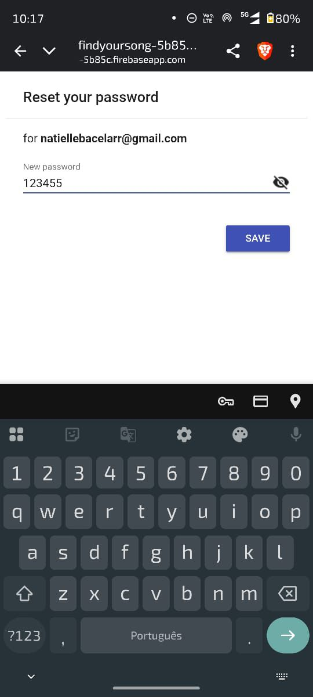

# 🎵 Find Your Song

Aplicativo mobile de recomendação musical que permite ao usuário descobrir novas músicas, artistas e álbuns de forma simples, rápida e intuitiva.

---

## 📱 Sobre o projeto

O **Find Your Song** foi desenvolvido como um projeto acadêmico com o objetivo de criar uma aplicação mobile moderna e responsiva para recomendação de músicas.

A aplicação consome dados de uma API externa e oferece ao usuário uma experiência fluida para explorar conteúdos musicais atualizados.

---

## 🎯 Objetivo

Desenvolver um aplicativo mobile capaz de:

* Recomendar músicas
* Exibir artistas e álbuns
* Facilitar a descoberta musical
* Proporcionar uma experiência intuitiva e agradável

---

## 🚀 Funcionalidades

* 🔍 Busca de músicas e artistas
* 🎧 Reprodução de prévias (30 segundos)
* ⭐ Favoritar músicas
* 🕘 Histórico de buscas
* 👤 Sistema de usuário (login/cadastro)
* 📱 Interface responsiva e moderna

---

## 🛠️ Tecnologias utilizadas

* Angular
* Ionic
* TypeScript
* HTML5 & SCSS
* API Deezer

---

## 🔌 API utilizada

**Deezer API**

A API foi escolhida por oferecer:

* Informações completas sobre músicas, artistas e álbuns
* Rankings e músicas populares
* Prévia de reprodução das músicas
* Fácil integração (JSON)

📎 https://developers.deezer.com/api

---

## 🎨 Protótipo

O design do aplicativo foi inicialmente desenvolvido no Figma, incluindo:

* Wireframes
* Definição de layout
* Experiência do usuário (UX)

---

## 📸 Preview

### 🚀 Tela inicial


### 🔐 Login


### 📝 Cadastro


### 🏠 Home


### ⭐ Favoritos 


### 🔐 Reset de senha



### 📝 Ouvidos Recentemente


### 🔐 Página de Perfil


---

## 📦 Como rodar o projeto

```bash
# Clonar o repositório
git clone https://github.com/seu-usuario/find-your-song.git

# Entrar na pasta
cd find-your-song

# Instalar dependências
npm install

# Rodar o projeto
ionic serve
```

---

## 👩‍💻 Equipe

* Kamyle Ferreira
* Natielle Bacelar
* Yasmim Almeida

---

## 📌 Status do projeto

✅ Concluído
🚀 Possíveis melhorias futuras:

* Integração com autenticação real
* Melhorias na UI/UX
* Sistema de recomendação mais avançado

---

## 💡 Considerações finais

Este projeto foi fundamental para o desenvolvimento de habilidades em:

* Desenvolvimento mobile
* Consumo de APIs
* Organização de código
* Trabalho em equipe

---

## ⭐ Contribuição

Sinta-se à vontade para contribuir ou sugerir melhorias!

---

## 📄 Licença

Este projeto é de caráter acadêmico e sem fins comerciais.
